---
# Front matter
lang: ru-RU
title: "ОТЧЕТ ПО ЛАБОРАТОРНОЙ РАБОТЕ №5"
subtitle: "Подгонка полиномиальной кривой"
author: "Аминов Зулфикор Мирзокаримович"

# Formatting
toc-title: "Содержание"
toc: true # Table of contents
toc_depth: 2
lof: true # List of figures
lot: true # List of tables
fontsize: 12pt
linestretch: 1.5
papersize: a4paper
documentclass: scrreprt
polyglossia-lang: russian
polyglossia-otherlangs: english
mainfont: PT Serif
romanfont: PT Serif
sansfont: PT Sans
monofont: PT Mono
mainfontoptions: Ligatures=TeX
romanfontoptions: Ligatures=TeX
sansfontoptions: Ligatures=TeX,Scale=MatchLowercase
monofontoptions: Scale=MatchLowercase
indent: true
pdf-engine: lualatex
header-includes:
  - \linepenalty=10 # the penalty added to the badness of each line within a paragraph (no associated penalty node) Increasing the value makes tex try to have fewer lines in the paragraph.
  - \interlinepenalty=0 # value of the penalty (node) added after each line of a paragraph.
  - \hyphenpenalty=50 # the penalty for line breaking at an automatically inserted hyphen
  - \exhyphenpenalty=50 # the penalty for line breaking at an explicit hyphen
  - \binoppenalty=700 # the penalty for breaking a line at a binary operator
  - \relpenalty=500 # the penalty for breaking a line at a relation
  - \clubpenalty=150 # extra penalty for breaking after first line of a paragraph
  - \widowpenalty=150 # extra penalty for breaking before last line of a paragraph
  - \displaywidowpenalty=50 # extra penalty for breaking before last line before a display math
  - \brokenpenalty=100 # extra penalty for page breaking after a hyphenated line
  - \predisplaypenalty=10000 # penalty for breaking before a display
  - \postdisplaypenalty=0 # penalty for breaking after a display
  - \floatingpenalty = 20000 # penalty for splitting an insertion (can only be split footnote in standard LaTeX)
  - \raggedbottom # or \flushbottom
  - \usepackage{float} # keep figures where there are in the text
  - \floatplacement{figure}{H} # keep figures where there are in the text
---

# Ход работы:

В матрице заданы значения 𝑥 в столбце 1 и значения 𝑦 в столбце 2.
Введём матрицу данных в Octave и извлечём вектора 𝑥 и 𝑦.

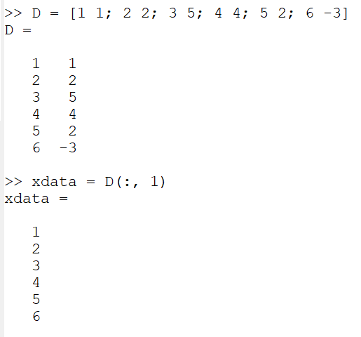{ #fig:001 width=70% }
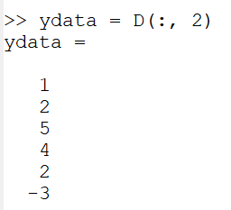{ #fig:001 width=70% }

Нарисуем точки на графике.

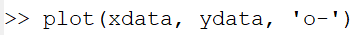{ #fig:001 width=70% }
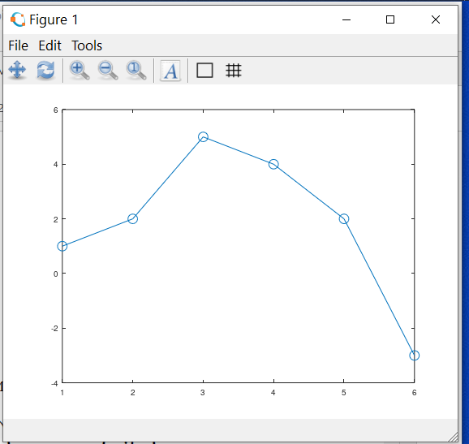{ #fig:001 width=70% }

Построим уравнение вида 𝑦 = 𝑎𝑥2 + 𝑏𝑥 + 𝑐.

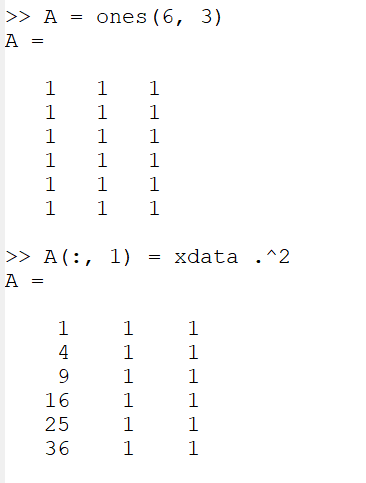{ #fig:001 width=70% }
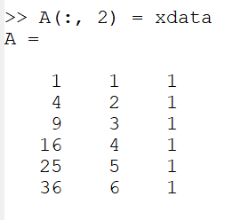{ #fig:001 width=70% }

Решение по методу наименьших квадратов получается из решения уравнения 𝐴^𝑇𝐴𝑏 = 𝐴^𝑇𝑦, где 𝑏 – вектор коэффициентов полинома Используем Octave для построения уравнений.

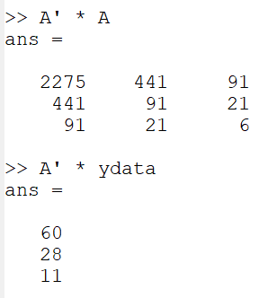{ #fig:001 width=70% }

Решим задачу методом Гаусса. Запишем расширенную матрицу:

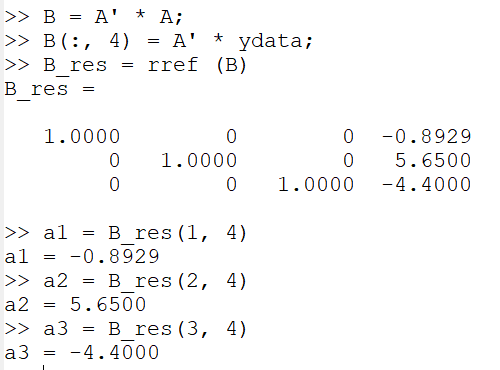{ #fig:001 width=70% }

Таким образом, искомое квадратное уравнение имеет вид:

𝑦 = −0.89286𝑥^2 + 5.65𝑥 − 4.4.

Построим соответствующий график параболы

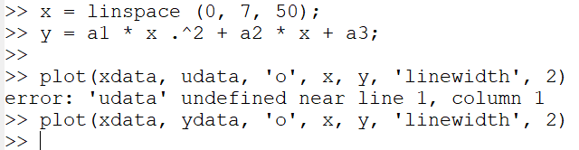{ #fig:001 width=70% }
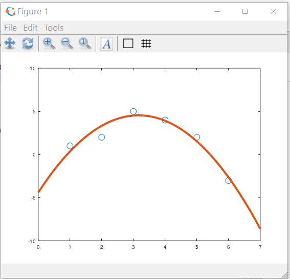{ #fig:001 width=70% }
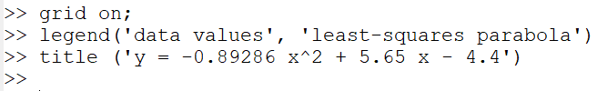{ #fig:001 width=70% }
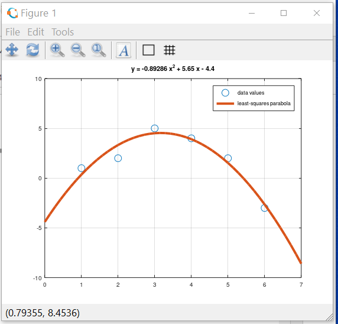{ #fig:001 width=70% }

Получим подгоночный полином.

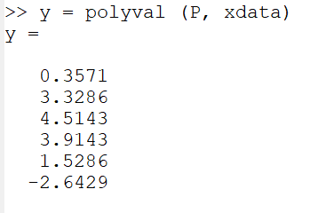{ #fig:001 width=70% }
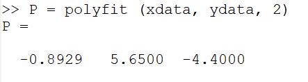{ #fig:001 width=70% }

Построим исходные и подгоночные данные.

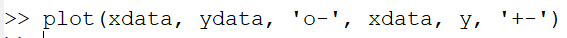{ #fig:001 width=70% }
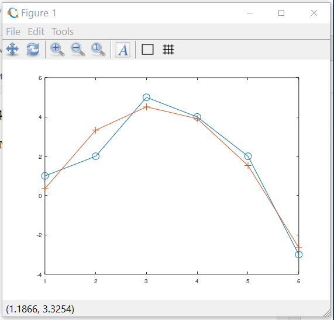{ #fig:001 width=70% }
{ #fig:001 width=70% }
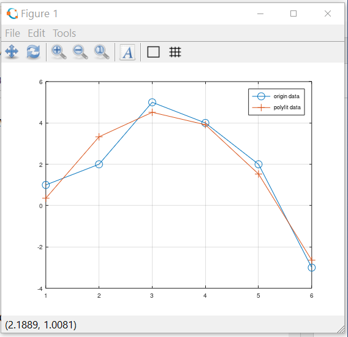{ #fig:001 width=70% }

# Матричные преобразования

Введём матрицу данных.

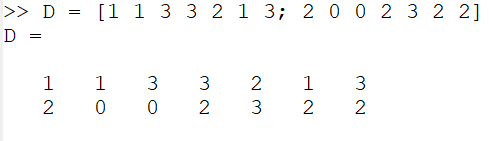{ #fig:001 width=70% }

Извлечём вектора 𝑥 и 𝑦 и нарисуем этот граф.

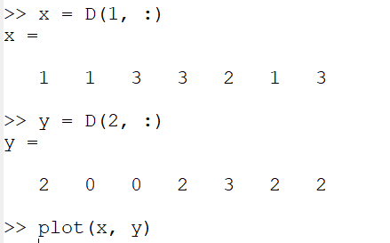{ #fig:001 width=70% }
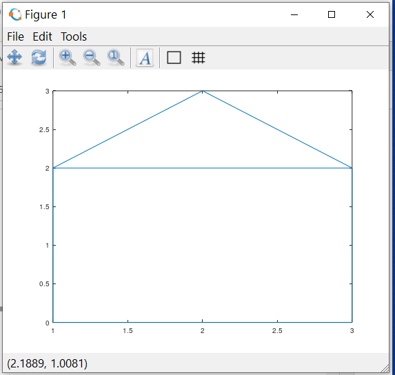{ #fig:001 width=70% }

# Вращение

Чтобы произвести повороты матрицы данных 𝐷, нам нужно вычислить произведение матриц 𝑅𝐷.

Повернём граф дома на 90∘ и 225∘. Вначале переведём угол в радианы.

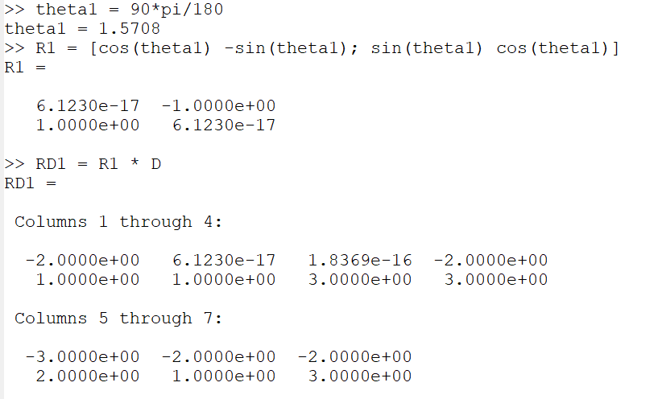{ #fig:001 width=70% }
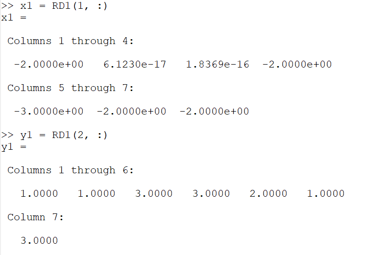{ #fig:001 width=70% }
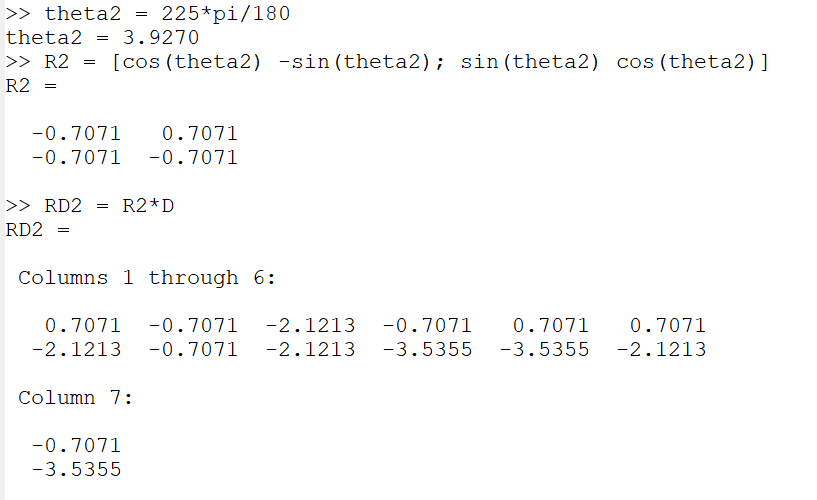{ #fig:001 width=70% }
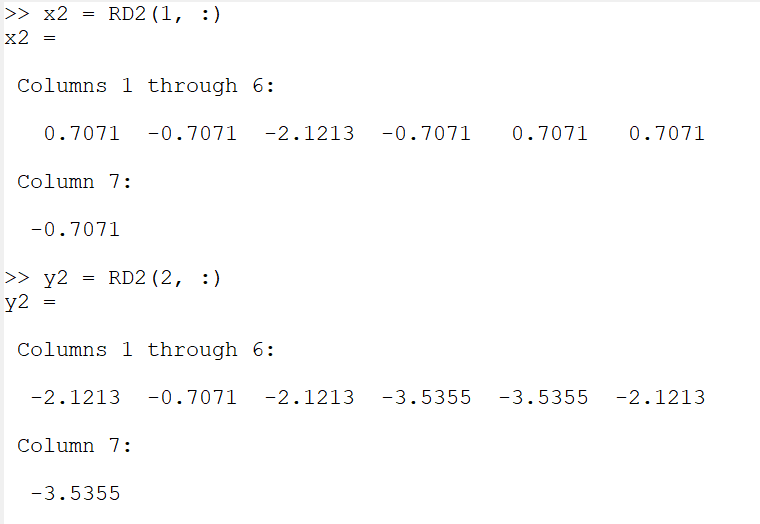{ #fig:001 width=70% }
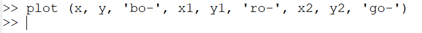{ #fig:001 width=70% }
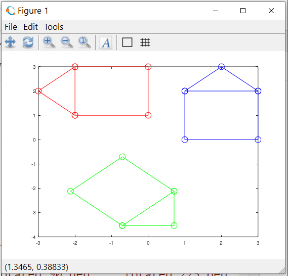{ #fig:001 width=70% }
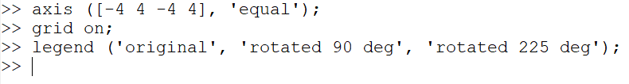{ #fig:001 width=70% }
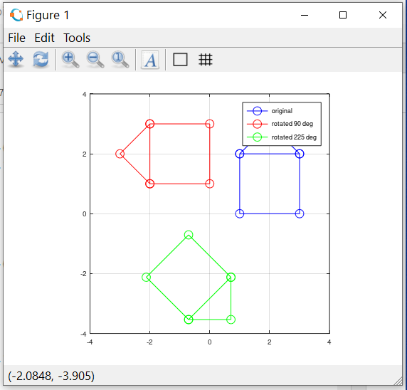{ #fig:001 width=70% }

# Отражение

Отразим граф дома относительно прямой 𝑦 = 𝑥. Зададим матрицу отражения (поясните, почему она такая).

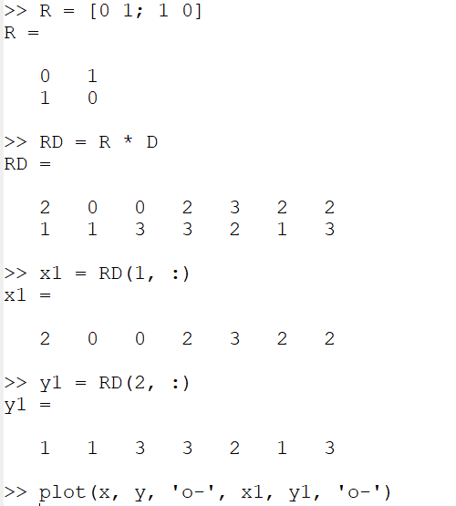{ #fig:001 width=70% }
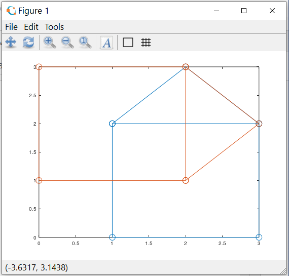{ #fig:001 width=70% }
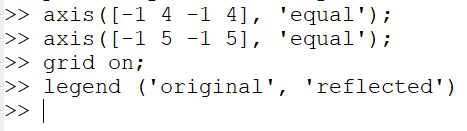{ #fig:001 width=70% }
{ #fig:001 width=70% }

# Дилатация

Увеличим граф дома в 2 раза.

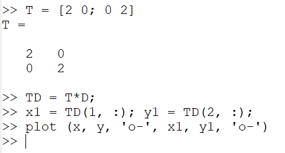{ #fig:001 width=70% }
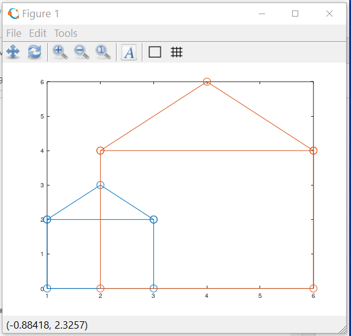{ #fig:001 width=70% }
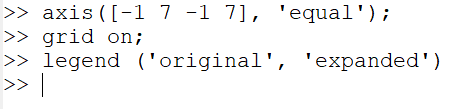{ #fig:001 width=70% }
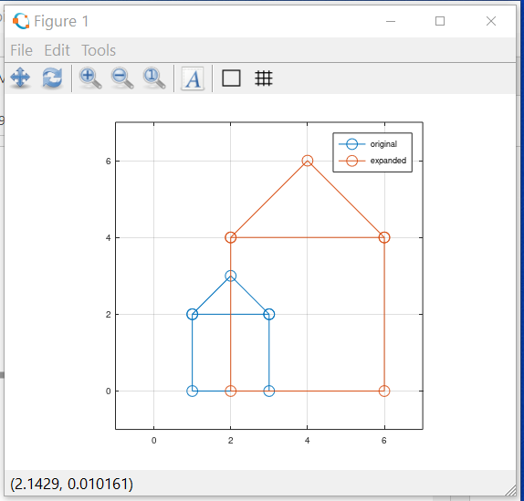{ #fig:001 width=70% }

# Вывод

В octave научился работать с подгонки полиномиальной кривой, с матричным преобразованием, вращений, отражений и дилатацией.
